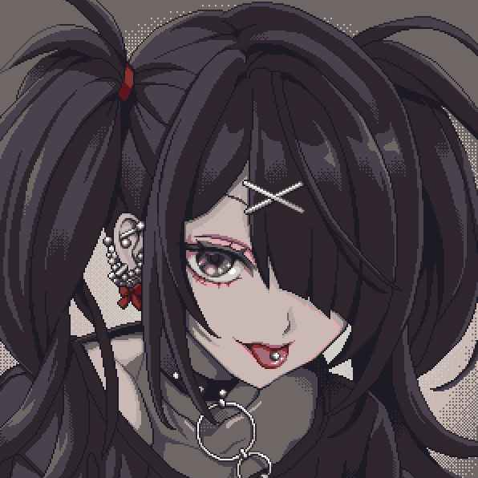

<h1 class="center-title">
  <marquee>
    Meet the weeb
  </marquee>
</h1>

  

    
    <h1>Nishimiya</h1>
    
 Nishimiya is a hobbyist developer who spends his time learning on
    creating vanilla websites but mostly writing arduino code for developing IoT
    project.    In his spare time, he likes building keyboard and doom
    scrolling bluesky. 
    
 

 

