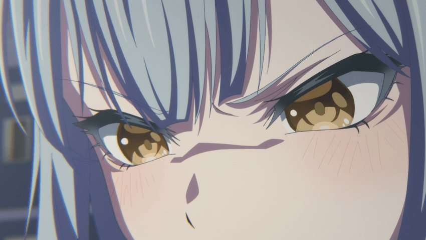
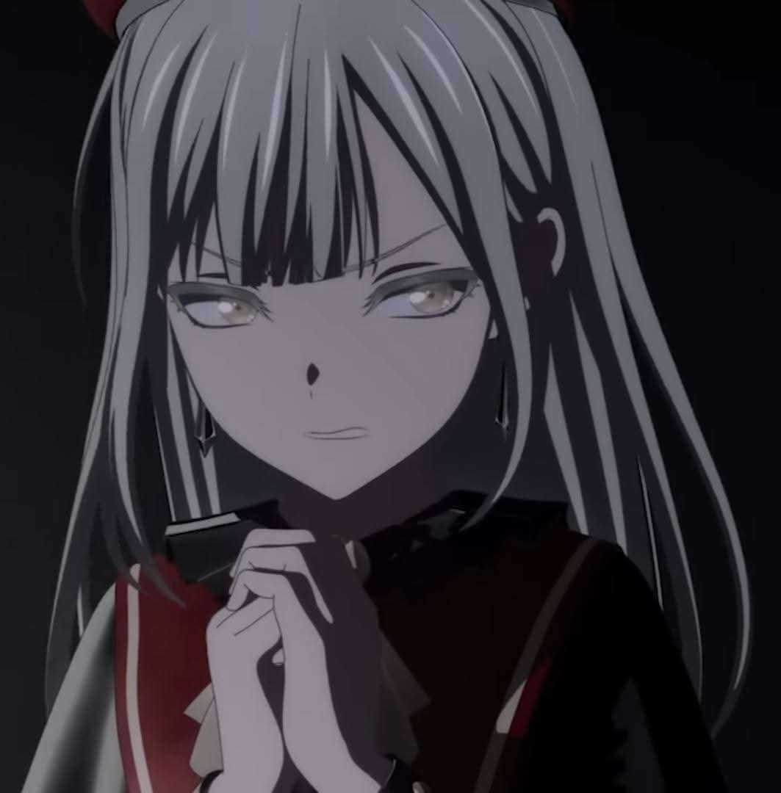
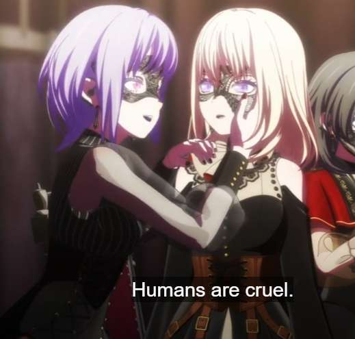
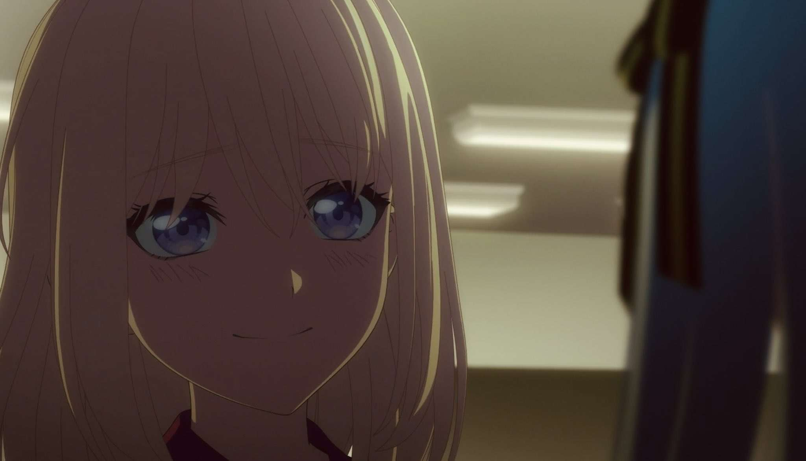

## **Episodes 1–3: Foundations of Fractured Identities**  
**In-Depth Analysis of *Ave Mujica – The Die is Cast*: Episodes 1–3**
*A Gothic Symphony of Control, Identity, and Psychological Unraveling*  

---

### **1. Premise and Thematic Foundations**  
*Ave Mujica – The Die is Cast* thrusts viewers into the shadowy world of a masked symphonic metal band, Ave Mujica, whose members grapple with fractured identities, ambition, and the weight of past traumas. The series, a spin-off of *BanG Dream! It’s MyGO!!!!!*, adopts a darker, more mature tone, trading typical idol anime tropes for psychological drama and gothic theatrics. The first three episodes establish a narrative steeped in duality—between artifice and authenticity, control and chaos, and the haunting echoes of disbanded predecessor CRYCHIC.  

---

### **2. Character Dynamics and Conflicts**  

#### **Sakiko Togawa (Oblivionis): The Architect of Delusion**  
**Role**: Founder, Keyboardist  
**Theatrical Name**: *Oblivionis* (Latin: "Of Oblivion")  
Sakiko, the tortured mastermind of Ave Mujica, is driven by a desperate need to control her crumbling reality. Her backstory—revealed through cryptic details like labeling police contacts (for her alcoholic father, Kiyotsugu Togawa)—paints a portrait of a girl clinging to order amid familial ruin. Her creation of Ave Mujica is both an escape from her disgraced family (her father’s embezzlement scandal destroyed their reputation) and a compulsive attempt to rewrite the failure of CRYCHIC, which she impulsively disbanded. Her theatrical persona, *Oblivionis*, embodies her desire to erase the past, symbolized by her mask’s shattered-glass motif.  

#### **Nyamu Yūtenji (Amoris): The Provocateur**  
**Role**: Drummer  
**Theatrical Name**: *Amoris* (Latin: "Of Love")  
Nyamu, the Insta-famous drummer, thrives on chaos and spectacle. Her decision to unmask the band during their Budokan debut forces Ave Mujica into the public eye as “human” rather than “dolls,” directly opposing Sakiko’s curated artifice. Her theatrical name *Amoris* reflects her performative obsession with love and validation, though her motivations are pragmatic: viral fame and financial survival. Her neon-lit livestreams and provocative persona clash with Sakiko’s Victorian gothic aesthetic, symbolizing the tension between modernity and tradition.  

#### **Mutsumi Wakaba (Mortis): The Fractured Prodigy**  
**Role**: Guitarist  
**Theatrical Name**: *Mortis* (Latin: "Of Death")  
Mutsumi, the band’s guitarist, is haunted by the collapse of CRYCHIC and the weight of her celebrity parents’ legacy (her mother is a renowned filmmaker). Her dissociative identity disorder manifests in *Mortis*, an alter ego who emerges to “protect” her from guilt and external pressures. Theatrical visuals—burning chickens, puppet strings—externalize her psychological fractures. Critics debate whether her portrayal romanticizes DID, but her arc underscores the series’ theme of **identity as performance**.  

#### **Uika Hatsune (Doloris): Lead Guitarist & Vocalist**  
**Role**: Lead Guitarist, Vocalist  
**Theatrical Name**: *Doloris* (Latin: "Of Pain")  
Uika, the band’s lead guitarist and vocalist, harbors a devastating secret: she is not the “real” Uika. Born **Hatsune**, she is Sakiko’s illegitimate aunt, the daughter of Sakiko’s grandfather and a housekeeper. Forbidden from interacting with Sakiko as children, she stole her half-sister Uika’s identity after the latter’s mysterious disappearance. Her theatrical name *Doloris* reflects her masochistic loyalty to Sakiko, whom she loves obsessively. Her crescent moon pendant symbolizes her incomplete identity, while her coffee rituals (contrasting Sakiko’s tea) force confrontations with harsh truths.  

#### **Umiri Misato (Timoris): The Bassist**  
**Role**: Bassist  
**Theatrical Name**: *Timoris* (Latin: "Of Fear")  
Umiri, the bassist, is a perfectionist battling Orthorexia—a fixation on “pure” eating symbolized by her protein shakes and sterile kitchen. Her theatrical name *Timoris* mirrors her fear of vulnerability and imperfection. She regulates chaos through rigid routines (symmetrically arranged accessories) and emotional detachment (“*I’m here to play, not to babysit*”). Her backstory reveals a fear of inheriting her mother’s “weakness” (her mother’s obesity), driving her obsession with control.  

---

### **3. Visual and Narrative Craftsmanship**  

#### **Gothic Aesthetics and Symbolism**  
The series’ Victorian-inspired stage designs and masked performances evoke a macabre dollhouse, mirroring the characters’ trapped existences. Visual motifs like shattered glass and carousels in the OP 「KiLLKiSS」 reinforce themes of cyclical despair and fragile identities. Episode 3’s hallucinatory sequences—where Mutsumi envisions herself as a puppet controlled by Sakiko—masterfully blend 3D CGI with 2D grotesquerie, though the inconsistent animation quality (notably jarring CGI in casual scenes) remains divisive.  

#### **Subtextual Storytelling**  
Director Kōdai Kakimoto and writer Yuniko Ayana employ *tiny details* to build tension:  
- Mutsumi’s worn basement chair, contradicting her mother’s claim that the room is unused, hints at her isolation.  
- Sakiko’s rigid posture during rehearsals contrasts with Nyamu’s fluid, attention-seeking movements, symbolizing their ideological clash.  
- The recurring Latin episode titles (e.g., *Sub Rosa*, *Exitus Acta Probat*) foreshadow the band’s fatalistic trajectory.  

---

### **4. Themes and Social Commentary**  

#### **The Masks We Wear**  
Ave Mujica literalizes the concept of masking through its stage personas, interrogating how performance obscures vulnerability. Sakiko’s insistence on maintaining the band’s “doll” image reflects her fear of exposure, while Nyamu’s unmasking rebellion challenges societal expectations of authenticity in art.  

#### **Generational Trauma and Parental Shadows**  
Mutsumi’s struggle to escape her parents’ legacy and Sakiko’s fraught relationship with her alcoholic father underscore the series’ exploration of inherited pain. Mutsumi’s mother, a filmmaker who co-opts her daughter’s musical talent, epitomizes the toxic overlap of parental ambition and artistic identity.  

#### **The Price of Ambition**  
The band’s rapid rise to Budokan fame becomes a metaphor for unsustainable success. Ave Mujica’s members—each battling insecurities—mirror real-world artists torn between creative fulfillment and industry pressures.  

---

### **5. Reception and Critique**  
The first three episodes polarized audiences:  
- **Praise** focused on the series’ emotional depth, voice acting (notably Mutsumi’s raw breakdowns), and daring narrative choices.  
- **Criticism** targeted the convoluted lore (reliant on *MyGO!!!!!* knowledge), uneven CGI, and concerns about romanticizing mental health struggles.  
- The OP 「KiLLKiSS」 and insert songs like *Ave Mujica* were universally lauded for blending symphonic metal with haunting melodies.  

---

### **6. Looking Ahead: A House of Cards on the Brink**

By Episode 3, the band’s fragile equilibrium shatters: Mutsumi’s fracture into Mortis, Sakiko’s eroding control, and Nyamu’s manipulative charisma foreshadow an inevitable collapse. The series’ strength lies in its willingness to delve into psychological horror, asking: *Can art born from pain ever heal its creators?*  

With its rich symbolism, flawed yet compelling characters, and unflinching exploration of darkness, *Ave Mujica* promises a crescendo of chaos—and perhaps catharsis—in its remaining episodes. As the Latin adage goes: *Acta est fabula*—the play is only beginning.  

---  

## **Episodes 4–6: The Unraveling of Artifice**
**In-Depth Analysis of Ave Mujica – The Die is Cast: Episodes 4–6**
*The Collapse of Masks and the Birth of New Selves*

---

### **Episode 4: *Acta est Fabula* – The Play is Over**  

Mortis’ emergence as a dominant persona is not merely a psychological breakdown but a **metaphor for artistic exploitation**. The burning chickens hallucinated by Mutsumi symbolize her creative energy being consumed by external pressures—Sakiko’s demands, parental expectations, and the band’s unsustainable perfectionism. Puppet imagery, recurring in the background (e.g., strings attached to Mutsumi’s guitar), reflects the broader theme of **control in the idol industry**, where artists are often reduced to marionettes for corporate or fan gratification.  

The disbandment announcement, staged as a grotesque theater performance, critiques performative vulnerability. By framing the breakup as a public spectacle, the series questions whether audiences crave *authenticity* or merely a curated version of pain. Sakiko’s insistence on scripting the disbandment (“We will exit as dolls”) contrasts with Nyamu’s chaotic unmasking, symbolizing the clash between **art as a controlled narrative** versus **art as lived chaos**.  

**Twitter Insights**:  
- Fans noted parallels to *Perfect Blue*, where performance and reality blur dangerously. One user highlighted Mortis’ line, *“The stage eats us alive,”* as a direct nod to the exploitative nature of fame .  
- Critics debated whether Mutsumi’s DID portrayal leans into stigmatization, though others argued it critiques how society commodifies mental health struggles for drama .  

---

### **Episode 5: Disbandment’s Aftermath – Fractured Souls**  
**Expanded Analysis**:  
Uika’s role as the “moon” evolves here. Her incomplete crescent pendant, introduced in Episode 1, now flickers in dim lighting during her solo scenes, symbolizing her fading hope. Her attempts to mediate the band’s reconciliation mirror the moon’s gravitational pull—subtle yet persistent. However, her failure to reunite the group underscores the **futility of forced unity** in a world that thrives on individualism. 

Sakiko’s self-isolation in her mansion, surrounded by CRYCHIC memorabilia, visualizes her entrapment in the past. The recurring shot of her father’s empty whiskey glass (a callback to Episode 1) becomes a metaphor for **inherited cycles of dysfunction**. Meanwhile, Nyamu’s viral livestreams—filmed in her neon-lit bedroom—contrast with Sakiko’s gothic mansion, symbolizing the generational divide: tradition (Sakiko) vs. digital modernity (Nyamu).  

**Twitter Insights**:  
- A viral thread dissected Uika’s wardrobe: her shift from monochrome outfits to a pink hoodie when meeting MyGO!!!!! signals her subconscious desire for warmth and connection.  
- Sakiko’s mansion layout, modeled after M.C. Escher’s *Relativity*, subtly implies her distorted perception of reality .  

---

### **Episode 6: *Animum reges.* – You Rule the Mind**  
**Expanded Analysis**:  
Mutsumi’s mind palace, depicted as a dilapidated theater, is layered with meaning. The cracked stage mirrors Ave Mujica’s disbanded state, while the audience seats filled with shadowy figures represent societal expectations haunting her. Mortis’ plea to Soyo—*“Wake her up before she forgets how to cry”*—reframes DID not as a disorder but as a **survival mechanism**, a persona crafted to endure emotional erasure.  

Umiri’s Orthorexia is explored through meticulous mise-en-scène: her apartment’s sterile whites and symmetrically arranged protein shakes contrast with her cluttered, colorful accessory collection. This visual dissonance mirrors her internal conflict—**control vs. desire**. Her compulsive shopping, criticized as frivolous, is recontextualized as a cry for identity: *“If I can’t control my body, I’ll control what adorns it.”*  

**Twitter Insights**:  
- A fan theory posited that Umiri’s protein shakes are labeled in German, nodding to her perfectionist “engineering” of self.  
- The mind palace’s theater curtains, embroidered with Ave Mujica’s logo, suggest Mutsumi’s identity is inseparable from the band’s artifice .  

---

## **Episodes 7–9: The Crescendo of Conflict**
**In-Depth Analysis of Ave Mujica – The Die is Cast: Episodes 7–9**
*Masks Shatter, Truths Emerge*

---

### **Episode 7: *Ignis Aurum Probat* – Fire Tests Gold**  

**Key Events**:  
- The band tentatively reunites for a guerilla live performance, but Sakiko’s controlling behavior reignites tensions.  
- Mutsumi begins merging memories with Mortis, leading to erratic behavior during rehearsals.  

**Symbolism & Themes**:  
1. **Fire as Alchemy**:  
   The episode title, a Latin proverb, frames conflict as a purifying force. Flames engulfing the rehearsal room (a hallucination triggered by Sakiko’s criticism) symbolize the **destructive potential of honesty**. Mutsumi’s guitar strings catch fire during a solo, blending her self-destructive guilt with artistic passion—a metaphor for creation born from pain .  
2. **The Guerilla Live as Rebellion**:  
   Performing unmasked in a public park, the band challenges Sakiko’s “dollhouse” ethos. The setting—a storm raging during their set—mirrors their internal chaos. Rain-soaked instruments and slipping masks literalize the futility of maintaining facades amidst turmoil .  

**Critical Beats**:  
- Sakiko’s breakdown mid-performance (“*I am NOT a doll!*”) marks her first step toward vulnerability, though she later retreats into denial.  
- Nyamu’s decision to livestream the performance without consent sparks debate: Is she exploiting trauma or democratizing art?  

---

### **Episode 8: *Lux in Tenebris* – Light in Darkness**  
**Key Events**:  
- Uika confronts Sakiko about her father’s influence, leading to a physical altercation.  
- Mortis temporarily “vanishes,” leaving Mutsumi catatonic and forcing the band to reckon with her absence.  

**Symbolism & Themes**:  
1. **The Lighthouse Motif**:  
   Uika drags Sakiko to a derelict lighthouse, a relic from their childhood. The structure, once a guiding light, now broken and dark, symbolizes **crushed idealism**. The confrontation under its flickering beam—Uika slapping Sakiko—echoes the Latin title: light (truth) emerges only in darkness (crisis) .  
2. **Mirrors and Fragmentation**:  
   Mortis’ disappearance is foreshadowed by shattered mirrors in Mutsumi’s apartment. Each shard reflects a different facet of her identity, questioning whether reintegration is possible—or desirable. The band’s search for Mutsumi mirrors their own fragmented selves .  

**Narrative Nuance**:  
- The episode’s cold color palette (blues and grays) shifts to warm amber during the lighthouse scene, symbolizing painful yet necessary catharsis.  
- Umiri’s subplot—her failed attempt to cook a meal for the band—subtly parallels her fear of “imperfect” nurturing. Burnt food becomes a metaphor for her self-sabotage .  

---

### **Episode 9: *Per Aspera ad Astra* – Through Hardships to the Stars**  
**Key Events**:  
- The band agrees to a high-stakes televised performance to salvage their reputation.  
- Mutsumi and Mortis reconcile in a hallucinatory duet, merging their personas temporarily.  

**Symbolism & Themes**:  
1. **The Cosmic Stage**:  
   The televised performance is staged as a celestial tableau—planets orbiting the band, Sakiko’s keyboard resembling a star map. This visual grandeur contrasts with the raw, intimate guerilla live, critiquing **art’s commodification**. The “stars” they reach are not artistic fulfillment but corporate validation .  
2. **The Merged Duet**:  
   Mutsumi and Mortis’ duet, *Silent Noise*, layers their voices into harmony. The overlapping lyrics (“*I am you / You are me*”) and shared guitar symbolize **tentative self-acceptance**. However, the final shot—a single tear splitting into two as they bow—hints at the instability of this union .  

---

### **Synthesis: The Illusion of Resolution**  
Episodes 7–9 escalate the series’ interrogation of identity through fire, light, and cosmic imagery. The band’s televised “triumph” is revealed as another mask, albeit one they choose collectively. Mutsumi’s fragile harmony with Mortis offers hope but no easy answers, mirroring the audience’s discomfort with unresolved mental health narratives.  

**Twitter Discourse**:  
- Critics praised the lighthouse scene’s direction but lamented the rushed corporate subplot, arguing it diluted the psychological focus .  

---

## **Episodes 10–13: The Final Performance**
**In-Depth Analysis of Ave Mujica – The Die is Cast: Episodes 10–13**
*Identity, Obsession, and the Price of Art*

---

### **Episodes 10–11: The Unmasking of Hatsune**

**Key Events**:  
- **Episode 10**: Ave Mujica reunites for a guerilla live performance, but tensions flare as Sakiko’s control clashes with Nyamu’s viral antics.  
- **Episode 11**: A 20-minute soliloquy by Hatsune (Uika) reveals her true identity as Sakiko’s aunt and her theft of her sister’s persona.  

**Thematic Breakdown**:  
1. **Hatsune’s Identity Theft and Familial Trauma**:  
   The bombshell of Episode 11 reframes the entire series: “Uika” is actually **Hatsune**, the illegitimate daughter of Sakiko’s grandfather, Sadaharu Togawa. Born to a housekeeper and raised in secrecy on Shodoshima, Hatsune grew up estranged from her half-sister, the *real* Uika, who shared a childhood bond with Sakiko. Forbidden from interacting with Sakiko, Hatsune’s envy culminated in a fateful moment when she impersonated her sister during Sakiko’s visit, igniting an obsession that defined her life .  

   Hatsune’s theft of Uika’s identity—adopting her name, pursuing her idol dream, and infiltrating Sakiko’s life—is a metaphor for **existential erasure**. By living as Uika, Hatsune seeks validation as a “human” worthy of love, a desire rooted in her childhood alienation: *“Sakiko turned a pitiful being like me into a human”* . This act of self-annihilation mirrors Mutsumi’s DID, but with a darker edge: Hatsune’s deception is both calculated and compulsive, driven by a need to rewrite her “defective” existence.  

2. **Coffee and Tea as Emotional Anchors**:  
   Hatsune’s ritual of preparing coffee for Sakiko—a beverage symbolizing harsh reality—contrasts with Sakiko’s preference for tea (fantasy). This dichotomy reflects their codependency: Hatsune forces Sakiko to confront their shared pain, while Sakiko retreats into denial. The act of brewing coffee becomes a twisted gesture of devotion, a way to tether Sakiko to the truth of their intertwined fates .  

3. **The Soliloquy as Psychological Horror**:  
   Episode 11’s monologue, staged in an empty theater, transforms Hatsune’s confession into a **Gothic play-within-a-play**. The lack of audience underscores her isolation, while projections of her past (e.g., Sakiko’s father, Kiyotsugu’s downfall) blur reality and delusion . Critics debated the episode’s pacing—some praised its raw intensity, while others criticized its exposition-heavy structure .  

**Character Dynamics**:  
- **Sakiko’s Complicity**: Sakiko’s muted reaction to Hatsune’s revelation—*“Shall we pretend it never happened?”*—exposes her own guilt. Her willingness to perpetuate the lie mirrors her handling of CRYCHIC’s disbandment: both are acts of emotional self-preservation .  
- **Nyamu’s Role**: Nyamu’s livestream of the guerilla live (Episode 10) forces the band into vulnerability, contrasting Hatsune’s curated lies. Her pragmatism (“*Ave Mujica is all I have left*”) highlights the series’ tension between authenticity and performance .  

---

### **Episode 12: The Fractured Family Reckoning**  
**Key Events**:  
- Hatsune returns to Shodoshima, confronting her mother and the ghost of her stolen identity.  
- Sakiko confronts her grandfather, Sadaharu, over his role in her father’s ruin.  

**Symbolism & Subtext**:  
1. **The Lighthouse Confrontation**:  
   Sakiko drags Hatsune to a derelict lighthouse—a relic of their childhood—where their argument under flickering light symbolizes **shattered idealism**. Sakiko’s outburst (*“Who decided that? Why do I have to do what you say?!”*) rejects familial determinism, challenging Hatsune’s self-imposed narrative as a “tragic heroine”.  

2. **The Real Uika’s Absence**:  
   The real Uika’s fate remains ambiguous, but her spectral presence haunts the episode. Fan theories speculate she died or remains trapped on Shodoshima, a victim of Hatsune’s envy. This absence critiques the idol industry’s demand for replaceable personas—Hatsune’s theft reflects how artistry consumes individuality.  

3. **Orthorexia and Control**:  
   Umiri’s subplot—her failed attempt to cook for the band—parallels Hatsune’s disordered identity. Both characters regulate chaos through ritual (Umiri’s protein shakes, Hatsune’s lies), but Episode 12 forces them to confront their fragility.  

**Critical Reception**:  
- The episode polarized fans. Some lauded its emotional rawness, particularly Sakiko’s defiance, while others found the rushed corporate subplot (Sadaharu’s scheming) jarring .  

---

### **Episode 13: The Final Performance – Masks Laid Bare**  
**Key Events**:  
- Ave Mujica and MyGO!!!!! perform a joint concert, blending their contrasting philosophies.  
- The series ends with Hatsune and Sakiko’s relationship unresolved but tentatively accepting.  

**Thematic Synthesis**:  
1. **Artifice as Catharsis**:  
   The finale’s staging—Ave Mujica as celestial bodies orbiting Sakiko’s keyboard—frames their music as both ephemeral and eternal. Their song *Per Aspera ad Astra* (“Through hardships to the stars”) acknowledges pain as the price of artistry. The lyrics (*“Even in pain, beauty is born”*) crystallize the series’ thesis: masks are not lies but survival tools .  

2. **Moon and Sun Imagery**:  
   Uika’s crescent pendant, now fully lit, symbolizes her incomplete reconciliation with Sakiko. Their final duet, bathed in moonlight, rejects closure in favor of fleeting harmony—a nod to the series’ refusal to romanticize healing.  

3. **The Horror of Authenticity**:  
   Nyamu’s viral fame backfires, exposing her “Amoris” persona as hollow. Her arc concludes with a quiet moment of self-doubt, contrasting her earlier bravado. Meanwhile, Mutsumi and Mortis’ merged performance (*“I am you / You are me”*) offers fragile hope, but their tear splitting into two hints at enduring fracture .  

**Legacy and Critique**:  
- The finale’s open-endedness divided audiences. While praised for its musical grandeur, critics noted unresolved threads (Umiri’s Orthorexia, Mortis’ stability). Yet this ambiguity aligns with the series’ Gothic ethos: *“Even if we vanish, our music lingers”* .  
- The incestuous undertones of Hatsune’s obsession sparked debate. Some fans embraced its tragic complexity, while others criticized it as sensationalist. The series’ alignment with *Evangelion*-esque psychological horror, however, justifies its unflinching approach .  

---

## **Conclusion: A Symphony of Broken Dolls**  
*Ave Mujica* concludes not with resolution but **metamorphosis**. Hatsune’s stolen identity, Sakiko’s inherited trauma, and Mutsumi’s fractured psyche remain unresolved, yet the band’s final performance transforms their pain into collective artistry. The series’ brilliance lies in its refusal to sanitize mental health struggles, instead framing them as the raw material of creation.  

As Hatsune whispers in Episode 13: *“The stage eats us alive, but we choose to sing.”* In this act of defiance, *Ave Mujica* cements itself as a Gothic masterpiece—a haunting ode to the masks we wear and the truths they obscure. 🌑🎭  

**Final Rating**: ★★★★★ (5/5) – An audacious exploration of identity, legacy, and the price of art.  

---  

**Thumbnail Image Credit**  
Official promotional art from [Ave Mujica Twitter Post](https://x.com/bang_dream_info/status/1905934207635058733), used under fair use for critical analysis.
