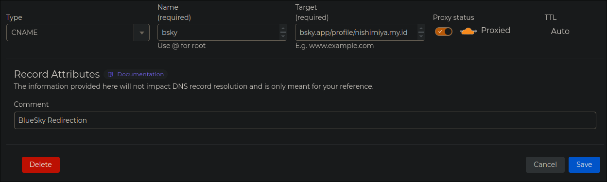
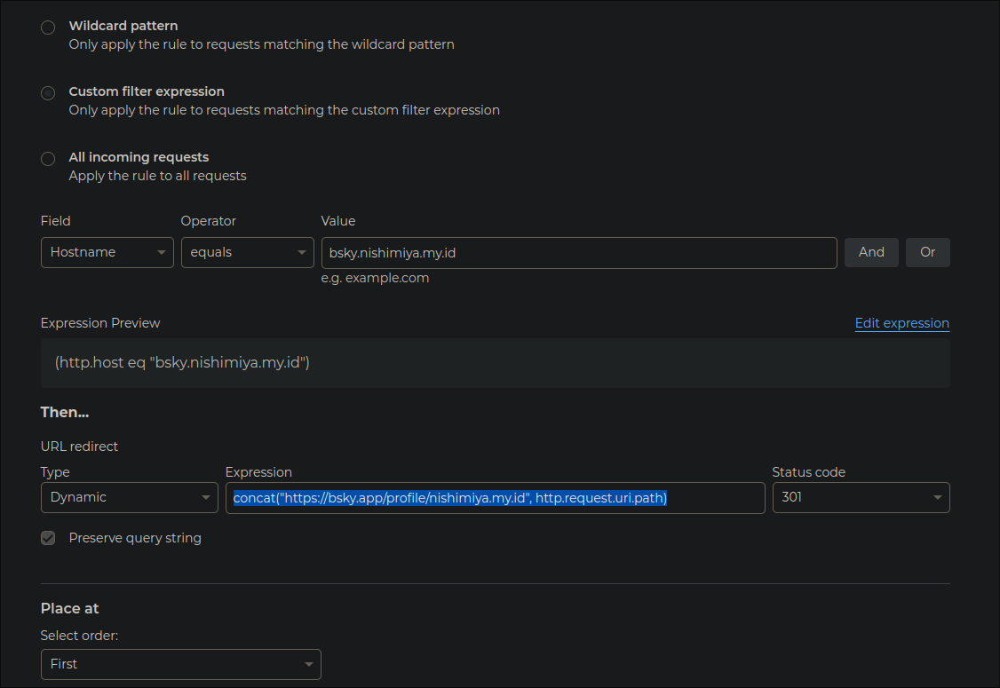

---
title: Bsky Redirect Trick Using Cloudflare
date: 2024-11-20 2:55:00+0700
slug: bsky-redirect
description: Sharing a post made it cleaner but also tedious.
image: hero-image.webp
categories:
    - Tech
tags:
    - BlueSky
    - social media
author: Nishimiya
--- 

Recently, I came across an interesting and creative trick shared by
[flamesoulis](https://bsky.app/profile/flamesoulis.com/post/3lb7br5kezc2y).
The trick involves using Cloudflare to create a seamless and branded
redirection for Bluesky profiles or posts. It's a clever approach that can
make your links look cleaner and more professional, and I thought it would
be exciting to share how you can implement it yourself. Whether you’re
looking to personalize your profile link or simplify sharing specific
posts, this method is both practical and easy to set up.

## Step 1: Create a CNAME Record



1. **Log in to your Cloudflare Dashboard.**
2. Go to the **DNS** section and add a new record:
   - **Type:** CNAME
   - **Name:** `bsky`
   - **Target:** `bsky.app/profile/nishimiya.my.id`  
   Replace `nishimiya.my.id` with your Bluesky username.
3. Save the changes.

## Step 2: Set Up a Redirect Rule



1. Navigate to the **Rules** section from the sidebar.
2. In the dropdown menu, select **Redirect Rules** and click **Create Rule**.

### Rule Configuration:
- **Name:** "Redirect to Different Domain [bsky]"
- **Filter Expression:**
   - Choose **Custom filter expression**.
   - Set **Hostname** to `equals`.
   - Value: `bsky.nishimiya.my.id` (replace `nishimiya.my.id` with your username).

### URL Redirect:
- Under **Type**, choose **Dynamic**.
- Use the following expression in the field:
  ```plaintext
  concat("https://bsky.app/profile/nishimiya.my.id", http.request.uri.path)
  ```
  Replace `nishimiya.my.id` with your username.
- Set the **Status Code** to **301**.
- Choose **Place At: First**.

3. Hit **Save**.

## Step 3: Test Your Redirection

Now that everything is set up, you can test your custom URL. Open your browser and try:

- `https://bsky.nishimiya.my.id` — Redirects to your Bluesky profile.
- `https://bsky.nishimiya.my.id/post/3lbcmwvuyyg2v` — Redirects to a specific post on Bluesky.

This setup uses a **dynamic redirect**, so the path after your custom
subdomain is appended to the Bluesky URL. While Bluesky’s share feature
provides direct links, this trick is a great way to create cleaner,
branded URLs for your profile and posts.
