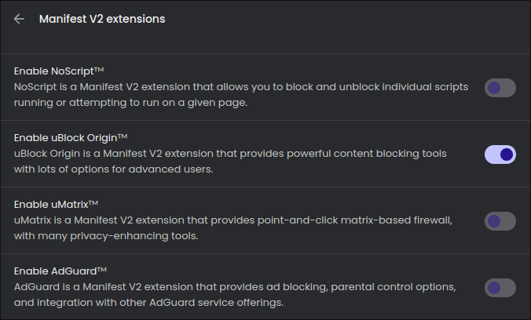
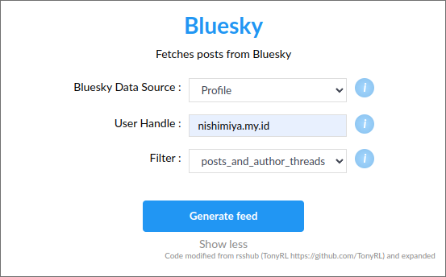
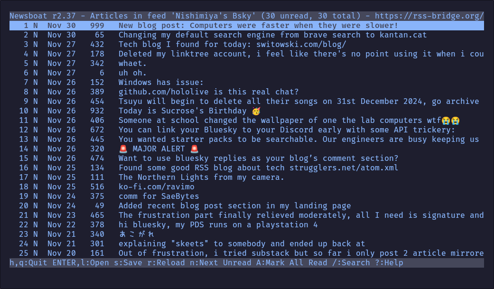

The web isn’t what it used to be. Once a place for creativity,
exploration, and discovery, it’s now a minefield of ads, trackers, and
bloated interfaces designed to keep you scrolling instead of getting
things done. But here’s the thing: you don’t have to be a passive consumer
in this digital kingdom. You can take control. You can own your
experience. You can be the landlord of the web instead of just another
peasant.  

This is my setup for browsing the web—not just through a browser but
beyond it. It’s not perfect, but it works for me. And maybe it’ll get you
thinking about how to reclaim the web for yourself.  

## My Browser Setup  

Let’s start with the browser. I use **Brave** now, but I was a Firefox
user before. Why did I switch? That’s a story for another time. What
matters here is that Brave supports **Manifest V2**, something Google is
actively trying to kill.  



Now, I’m not one for conspiracy theories, but it’s hard to ignore how
convenient it is for Google that **Manifest V3** cripples ad blockers.
uBlock Origin? Gone from the Chrome Web Store. Why? Because blocking ads
doesn’t exactly line up with Google’s business model. But Brave? Brave
still lets you use those powerful extensions.  

Here’s what I’ve got installed:  
- **uBlock Origin** to block ads and trackers.  
- **SponsorBlock** to skip sponsored segments on YouTube.  
- **Dark Reader** because light mode is an assault on my eyes.  
- **Vimium** for fast, keyboard-driven browsing.  
- **Proton Pass and VPN** for security and password management.  

To enable Manifest V2 extensions in Brave:  
1. Open Brave settings
2. Search for Manifest V2 extensions
3. Enable the extensions, such as uBlock Origin, NoScript, uMatrix, and AdGuard

With this setup, I don’t have to deal with ads, pop-ups, or other
nonsense. If your browser isn’t giving you that level of control, you’re
doing it wrong.  

## YouTube Without the Junk  

Let’s talk about YouTube. It’s a mess—ads everywhere, autoplaying
recommendations, and more distractions than a toddler in a toy store.
Watching a single video shouldn’t feel like navigating a minefield.  

So, here’s what I do:  
1. I use **Invidious**, an ad-free front-end for YouTube. This instance works
   for me: [inv.nadeko.net](https://inv.nadeko.net/).  
2. Export your subscriptions from YouTube.  
   - Go to [Google Takeout](https://takeout.google.com/), request your YouTube
     data, and download it.  
3. Import those subscriptions into Invidious.  
   - Once imported, click the **RSS icon** in your subscriptions tab to
     generate a feed (using a token if needed).  
4. Use **Newsboat**, a command-line RSS reader, to manage subscriptions.  



Here’s the cool part: I don’t even need a browser to watch YouTube. My
**Newsboat** config file lets me use **MPV** to play videos:  

```plaintext
browser qutebrowser
macro , open-in-browser
macro v set browser "setsid -f mpv --really-quiet --no-terminal"; open-in-browser; set browser browser
```  

Now I just press `,v` in Newsboat, and the video plays in MPV, bypassing
YouTube’s bloated interface entirely.  

## Social Media? No Thanks  

Social media platforms are time sinks. Endless scrolls, algorithm-driven
feeds, and constant distractions. But you don’t have to quit entirely. You
can still get updates from accounts or topics you care about without
logging into the platforms.  



I use **RSS-Bridge**, a tool that turns social media accounts into RSS
feeds. Here’s how:  
1. Visit a public RSS-Bridge instance, like [RSS-Bridge](https://rss-bridge.org/).  
2. Search for a service, such as Bluesky, and enter the user’s handle.  
3. Customize filters if needed and generate the feed.  
4. Copy the **MRSS** or **Atom** link and add it to your RSS reader.  

For example, you can follow Bluesky accounts without ever opening Bluesky.
Not all bridges are perfect, but they work well enough to cut the noise
and give you only what you need.  

---

## So What’s the Point?  

The big players of the internet—Google, Meta, YouTube—they’re not looking
out for you. They want your data, your clicks, your time. They’ve turned
the web into a space designed to exploit, distract, and monetize.  

But you don’t have to play along. You can carve out a web experience that
works for you. Use tools like Brave, Invidious, RSS-Bridge, and Newsboat
to reclaim control. Cut the bloat, skip the noise, and focus on what
matters to you.  

It’s not about being perfect or even radically different. It’s about
realizing you have a choice. You don’t have to be a passive consumer in
someone else’s digital kingdom. You can be the landlord. You just have to
take the first step.  
