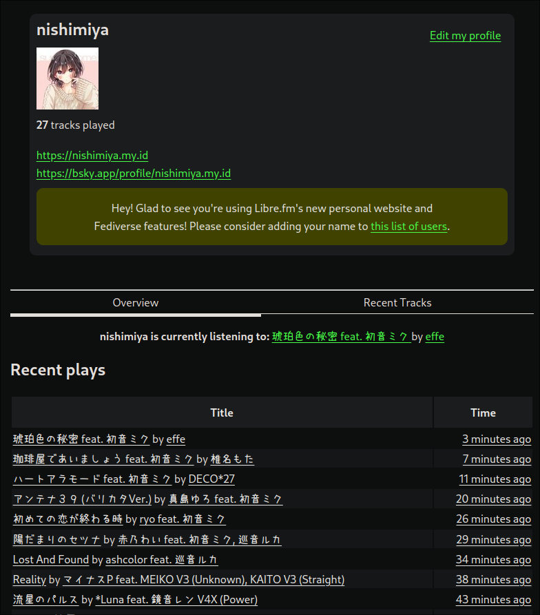

---
title: Bridging MPD Server-client to Libre.fm Using Mpdas
description: Tracking music has never been this easy and free as in freedom!
date: 2024-11-14 18:05:00+0700
slug: mpd-bridge-librefm
image: libre.fm_logo.svg
categories:
    - Tech
tags:
    - MPD
    - scrobbling
    - librefm
author: Nishimiya
--- 

## Why Use Mpdas with Libre.fm?

**Mpdas** (MPD Audio Scrobbler) is a lightweight, efficient tool that acts
as a bridge between MPD servers and scrobbling platforms like Libre.fm.
For anyone unfamiliar, MPD is a versatile, open-source music server
popular among audiophiles and Linux users. It plays music from a local
library, internet radio, or streaming services, and it integrates well
with various lightweight clients like **ncmpcpp**. 

Libre.fm, meanwhile, offers a refreshing alternative to Last.fm by
prioritizing user control and open-source principles. It’s
a community-oriented service that allows users to "scrobble" (log) their
played tracks without sacrificing their data privacy. With Mpdas and
Libre.fm, you can track what you’re listening to, explore your listening
history, and discover music—all without corporate oversight.

## My take on Security Configuration: It Uses Plain Text Passwords

As of **Mpdas version 0.4.3**, **Last.fm deprecated MD5 password
hashing**, requiring Mpdas to switch to plain-text passwords. In this
version, passwords for scrobbling services must be stored as plaintext in
the configuration file. Although this might raise a security concern, you
can protect your data by restricting access to the configuration file.
Placing it in a restricted-access directory or managing permissions can
help ensure that your password is secure on your machine.

## Step-by-Step Guide to Setting Up Mpdas

Ready to connect your MPD server to Libre.fm? Follow these steps, and
you’ll be scrobbling in no time.

### Step 1: Install Mpdas

Installing Mpdas is straightforward, thanks to its availability in most
Linux distribution repositories. Here’s a quick installation guide for
some popular Linux distros:

- **Arch Linux**: Install Mpdas using the `yay` package manager.
  ```bash
  yay -S mpdas
  ```

- **Debian/Ubuntu**: Install via `apt` if Mpdas is available in the repositories.
  ```bash
  sudo apt install mpdas
  ```

- **Fedora**: Use `dnf` to install Mpdas, if it’s available in your repositories.
  ```bash
  sudo dnf install mpdas
  ```

If Mpdas isn’t available through your package manager, you may need to
compile it from source. The [official Mpdas GitHub
repository](https://github.com/hrkfdn/mpdas) has detailed instructions on
how to do this.

### Step 2: Configure Mpdas

Once installed, you’ll need to configure Mpdas so it can log into your
Libre.fm account and scrobble your plays. 

1. Open the Mpdas configuration file, typically found at `/etc/mpdasrc`.
   Use your preferred text editor with root permissions: ```sudo vim
   /etc/mpdasrc ```

2. In this file, add the following configuration, replacing `<username>`
   and `<plain-text-password>` with your actual Libre.fm credentials:

   ```plaintext
   username = <username>
   password = <plain-text-password>
   port = 6600
   runas = mpd
   service = librefm
   debug = 1
   ```
Type `ZZ` to write then quit.

Here’s what each setting does:

- **username** and **password**: Your Libre.fm login credentials.
- **port**: Sets the MPD server connection port. Default is `6600`, so if
  you haven’t customized your MPD setup, this should work fine.
- **runas**: Defines the user under which Mpdas should run. Here, it’s set
  to `mpd`.
- **service**: Specifies the scrobbling service. Set this to `librefm` to
  scrobble with Libre.fm. (Default last.fm)
- **debug**: Enables debugging if set to `1`, which can help with
  troubleshooting if needed.

3. Save and close the configuration file.

### Step 3: Enable and Start Mpdas as a User Service

After configuring Mpdas, start it as a user service to keep it running in
the background. By enabling it as a user service, Mpdas will run each time
you log in, making the setup hassle-free.

1. Run the following command to enable and start Mpdas as a user service:
   ```bash
   systemctl enable --now --user mpdas.service
   ```

   This command does two things: it starts Mpdas immediately and ensures
   that it will start automatically each time you log in.

2. Open your MPD music client (e.g., `ncmpcpp`) and start playing some
   music. This step will let you confirm that the setup is working
   properly.

3. Go to your Libre.fm profile and check the "Now Playing" section. If
   everything is set up correctly, you’ll see the current track being
   scrobbled in real-time, reflecting the music playing in your MPD
   client.

### Step 4: Loving and Unloving Tracks on Libre.fm
With Mpdas, you can also mark your favorite tracks by “Loving” them, just
like on Last.fm. This feature allows you to mark songs you particularly
enjoy for easier recall later.

To love a track, use the following command:
```bash
mpc sendmessage mpdas love
```
If you want to unlove (or revert) a track, simply use:
```bash
mpc sendmessage mpdas unlove
```

## Wrapping Up: Enjoy Real-Time Music Tracking with Libre.fm


Congratulations! With Mpdas up and running, you now have a powerful,
privacy-focused way to track your listening habits. This setup combines the
flexibility of MPD, the simplicity of Mpdas, and the openness of Libre.fm,
giving you a complete music experience that respects your data and privacy.

Now, your plays are seamlessly logged on Libre.fm. Whether you’re using
**ncmpcpp**, **Cantata**, or any other MPD client, you’ll be able to track and
analyze your music tastes effortlessly. So sit back, press play, and enjoy your
music journey!
