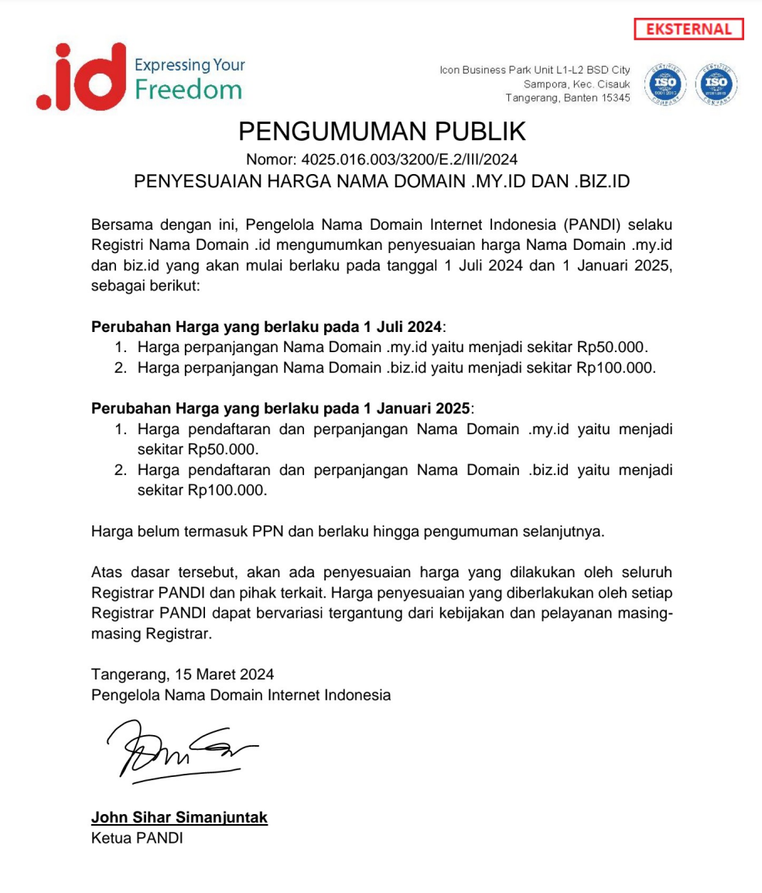
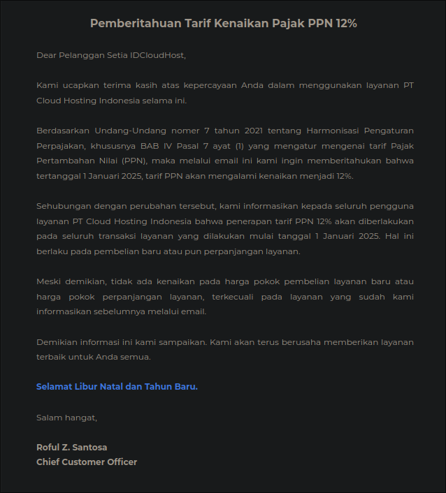

Recently, I received an email from my domain provider notifying me that PANDI
will increase the prices for .my.id and .biz.id domains starting January 1,
2025. However, this isn’t exactly breaking news. According to [Ufal Salman’s
blog post](https://ufal.my.id/2024/03/23/domain-myid-naik/), PANDI actually
made the official announcement on Friday, March 15, 2024. What’s interesting is
that the price adjustment will be rolled out in two phases. The first phase
begins on July 1, 2024, followed by the second phase on January 1, 2025.  

Starting July 1, 2024, the renewal price for .my.id domains will rise to
Rp50,000, while .biz.id domains will cost Rp100,000. Then, on January 1, 2025,
both registration and renewal fees will align with these new prices. This is
a significant jump from the previous rates, which ranged between Rp10,000 and
Rp12,000.  

These domains have long been a favorite for many due to their affordability and
availability through numerous local registrars. Whether for personal blogs or
business websites, .my.id and .biz.id have been reliable and cost-effective
choices. However, with the upcoming price increases, some may start exploring
other options.  

When compared to other domains, the new price of .my.id will be similar to
.ac.id, .sch.id, .or.id, and .web.id, which are priced around Rp50,000.
Meanwhile, .id domains remain at Rp220,000, and .co.id at Rp300,000. Despite
the hike, .my.id and .biz.id are still relatively budget-friendly compared to
some premium domains.

Adding to the recent polemic about tax increases starting January 1, 2025,
my domain provider also shared an email regarding the upcoming changes.
Based on Law No. 7 of 2021 on the Harmonization of Tax Regulations,
specifically Chapter IV Article 7 Paragraph (1), the Value Added Tax (VAT)
rate will increase to 12% starting January 1, 2025. This means that all
transactions, including new purchases and service renewals, will be
subject to the new VAT rate.

However, the provider clarified that there will be no increase in the base
price of new services or renewals, except for the specific services
previously communicated via email.

If you’re looking to avoid the higher costs, here’s a tip: consider renewing
your domain now for multiple years, depending on what your registrar offers.
This allows you to lock in the current rate of Rp12,000, even after the price
increase. While it requires a larger upfront payment, it’s a smart way to save
money in the long run. Think of it as an investment in your domain’s future!  
